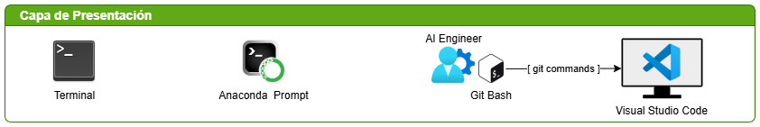
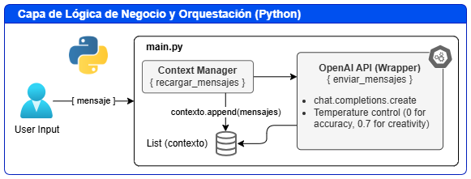
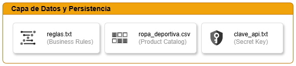
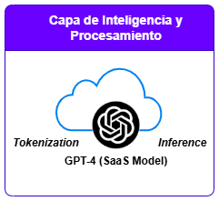
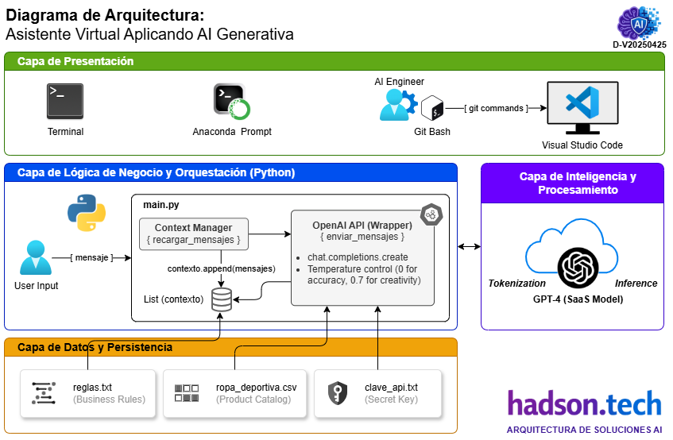

# Diagrama de Arquitectura

## Título: Asistente Virtual Aplicando AI Generativa

Este documento detalla la arquitectura de un **Asistente Virtual - Chatbot personalizado** especializado en ropa deportiva, basado en GPT-4. 

---

## 1. Capas de la Arquitectura

### 🟢 Capa de Presentación (Interfaz de Usuario)
* **Tecnología:** CLI (Command Line Interface).
* **Funcionamiento:** Utiliza un bucle síncrono de entrada/salida en la terminal de Anaconda/VS Code. Es la capa más básica para el consumo de servicios de IA en etapas de prototipado.

    

### 🔵 Capa de Lógica de Negocio y Orquestación
* **Tecnología:** Python 3.10+ (Scripting de Orquestación).
* **Componentes Clave:**
    * **Orquestador de Contexto:** La función `recargar_mensajes` gestiona el flujo de datos. Implementa un patrón de "Memoria de Corto Plazo" mediante la lista `contexto`.
    * **Manejador de API:** La función `enviar_mensajes` actúa como un wrapper (envoltorio) del SDK de OpenAI, abstrayendo la complejidad de la petición HTTP.

        

### 🟡 Capa de Datos y Persistencia (Base de Conocimientos)
* **Tecnología:** Flat File System (Archivos Planos).
* **Estructura:**
    * **Base de Conocimientos:** `ropa_deportiva.csv`. Actúa como una base de datos "en memoria" una vez que el script la lee.
    * **Motor de Reglas:** `reglas.txt`. Define el "Guardrail" o las limitaciones éticas y operativas del agente.
* **Limitación:** Al cargar todo el CSV en el *system message*, la arquitectura depende totalmente del límite de tokens del modelo GPT-4.

    

### 🟣 Capa de Inteligencia y Procesamiento (Core Engine)
* **Tecnología:** GPT-4 (OpenAI Cloud).
* **Modelo de Despliegue:** SaaS (Software as a Service). El procesamiento ocurre en la nube de OpenAI; el script envía el estado completo del sistema en cada interacción.
* **Parámetros:**
    * **Temperatura 0:** Precisión para consultas de inventario.
    * **Temperatura 0.7:** Naturalidad para la interacción con el cliente.

        
---

## 2. Flujo de Datos Arquitectónico

1.  **Bootstrap (Carga Inicial):** El sistema lee los archivos físicos y construye el Estado Inicial del agente.
2.  **Inyección de Prompt:** Se aplica la técnica de **In-Context Learning**. El modelo recibe la información como instrucciones de sistema.
3.  **Ciclo de Inferencia:**
    * `Usuario` → Entrada de texto.
    * `App` → Construye el Payload (Historial + Nuevo Mensaje).
    * `OpenAI API` → Procesamiento de Tokens.
    * `App` → Actualización de Memoria (Append a la lista de contexto).

---

## 3. Evaluación de Arquitecto

| Atributo | Estado Actual | Recomendación Hadson.TECH |
| :--- | :--- | :--- |
| **Escalabilidad** | Baja (Límite de tokens) | Implementar arquitectura **RAG** (Vector Database) |
| **Seguridad** | Vulnerable (API Key en texto) | Usar Variables de Entorno o Secret Management |
| **Latencia** | Dependiente de red y tamaño CSV | Cachear respuestas o usar GPT-4o mini |

---

## 4. Diagrama de Arquitectura Integral

Su estructura se organiza en cuatro capas clave: la de Presentación, que gestiona la interacción mediante una interfaz CLI; la de Orquestación, donde Python coordina el flujo de datos y la memoria de contexto; la de Datos, que actúa como base de conocimientos inyectando archivos CSV y reglas de negocio; y el Motor de Inteligencia, que procesa la inferencia vía SaaS en la nube de OpenAI. El flujo emplea In-Context Learning para personalizar respuestas según el inventario local. 

> **Nota de la Solución desde la visión Arquitectónico:** Esta arquitectura es ideal para un **MVP**. El siguiente nivel evolutivo consiste en separar el catálogo del prompt y migrar hacia una **búsqueda semántica**. Se recomienda evolucionar hacia una arquitectura RAG y el uso de variables de entorno para optimizar la escalabilidad y seguridad de la solución técnica.

---

*Documentación elaborado por [Hadson Paredes](https://www.linkedin.com/in/hadson-paredes/) - 2026*