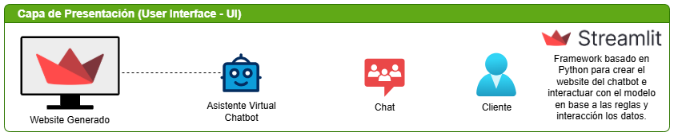
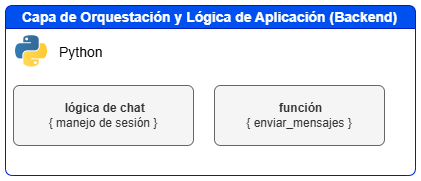
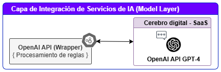
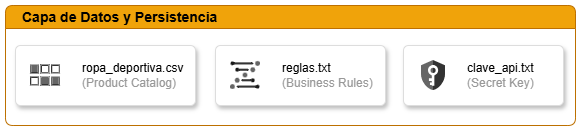
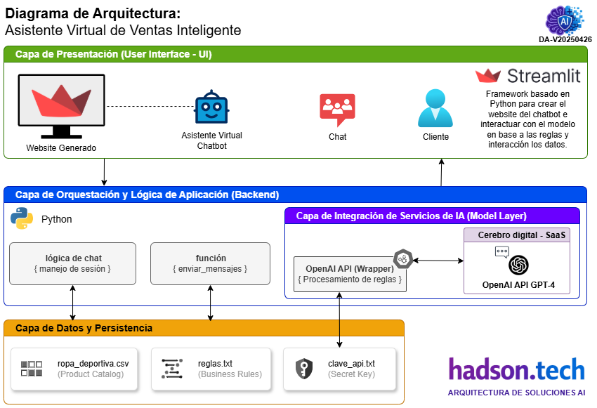

Para el **Asistente Virtual de Ventas Inteligente**, la arquitectura se define bajo un modelo de **n-capas desacopladas**, donde la lógica de presentación, la lógica de negocio y el acceso a datos están claramente diferenciados, a pesar de residir en un aplicación (script) principal.

A continuación, se detalla la arquitectura tecnológica:

---

## Arquitectura de Referencia en Capas

### 🟢 1. Capa de Presentación (User Interface - UI)
Es la capa superior con la que interactúa el usuario final. En este caso, es **completamente reactiva**.
* **Tecnología:** Streamlit.
* **Componentes:** Títulos (`st.title`), entradas de texto (`st.text_input`), botones de acción (`st.button`) y contenedores de mensajes (`st.markdown`).
* **Función:** Capturar la intención del usuario y renderizar la respuesta del asistente en tiempo real.

    

### 🔵 2. Capa de Orquestación y Lógica de Aplicación (Backend)
Actúa como el cerebro intermedio que gestiona el estado y el flujo de la información.
* **Tecnología:** Python (Lógica central).
* **Componentes:**
    * **Gestión de Estado:** `st.session_state` actúa como un bus de memoria volátil para mantener el historial del chat (contexto).
    * **Controlador de Flujo:** La función `enviar_mensajes` que encapsula la lógica de comunicación con el proveedor de IA.
* **Función:** Formatear los mensajes según el protocolo de OpenAI y decidir cuándo llamar al modelo.

    

### 🟡 3. Capa de Integración de Servicios de IA (Model Layer)
Es donde ocurre el procesamiento cognitivo y la generación de lenguaje natural.
* **Tecnología:** OpenAI API (Modelo **gpt-4**).
* **Componentes:** API REST a través de la librería cliente de `openai`.
* **Función:** Recibir el contexto (reglas + productos + historial) y generar una respuesta coherente basada en probabilidad lingüística.

    

### 🟣 4. Capa de Datos y Conocimiento (Data Layer)
Esta capa provee la información estática y las reglas que "entrenan" al asistente en tiempo de ejecución.
* **Tecnología:** Sistema de archivos local (Flat Files).
* **Componentes:**
    * `ropa_deportiva.csv`: Actúa como una base de datos de productos.
    * `reglas.txt`: Define el "System Prompt" o comportamiento de la marca.
    * `clave_api.txt`: Almacén de credenciales de seguridad.
* **Función:** Suministrar el conocimiento específico del dominio (Sport) al modelo de IA.

    
---

## Tabla Resumen del Stack Arquitectónico

| Capa | Componente Tecnológico | Responsabilidad |
| :--- | :--- | :--- |
| **Frontend** | Streamlit Framework | Interfaz Web y renderizado de mensajes. |
| **Backend** | Python Core | Lógica de negocio y manejo de sesiones. |
| **AI/ML** | OpenAI GPT-4 | Procesamiento de lenguaje natural e inferencia. |
| **Storage** | CSV / TXT Files | Almacenamiento de catálogo y configuración. |
| **Security** | API Key Authentication | Validación de identidad ante el servicio cloud. |

---
## Diagrama de Arquitectura Integral
Esta arquitectura es del tipo **Monolítica para el Frontend/Backend** pero **Distribuida para la Inteligencia Artificial**, ya que delega la carga computacional pesada a los servidores de OpenAI mediante una arquitectura de microservicios externos.

---

*Documentación elaborado por [Hadson Paredes](https://www.linkedin.com/in/hadson-paredes/) - 2026*