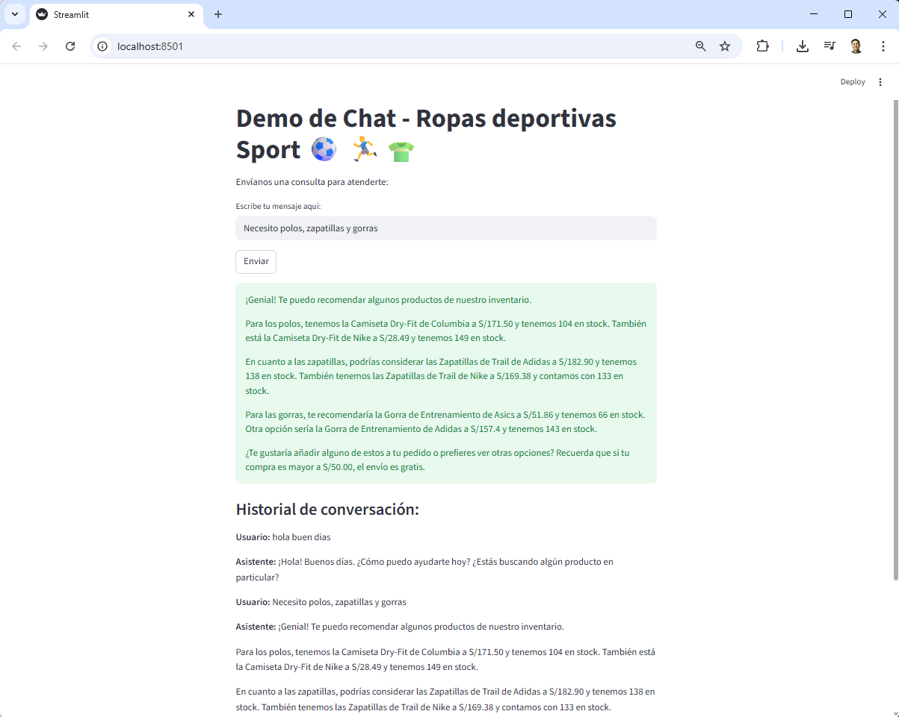

## Documentación: Asistente Virtual de Ropas Deportivas Sport

Este asistente virtual es una solución interactiva diseñada para optimizar la experiencia del cliente en el sector de ropa deportiva. Mediante el uso de inteligencia artificial avanzada, la aplicación procesa catálogos en formato CSV y reglas de negocio personalizadas para ofrecer recomendaciones precisas sobre productos, tallas y existencias.

---

### 1. Requisitos Previos

Para ejecutar esta aplicación, se necesitan los siguientes componentes:
* **Clave de API de OpenAI:** Almacenada en un archivo llamado `clave_api.txt`.
* **Base de datos local:** Un archivo `ropa_deportiva.csv` con el catálogo de productos.
* **Directrices:** Un archivo `reglas.txt` que define el tono y comportamiento del bot.
* **Entorno Python:** Instalación de las librerías `openai` y `streamlit`.

---

### 2. Análisis del Código por Capas

> **Importante:** Se agrego código para corregir el error de SSL en Windows para ejecutar la aplicación desde Visual Studio Code

```python
# --- AGREGA ESTO PARA REPARAR EL ERROR ---
if "SSL_CERT_FILE" in os.environ:
    del os.environ["SSL_CERT_FILE"]
# -----------------------------------------
```

#### **Capa 1: Gestión de Datos y Configuración**
Se encarga de cargar las credenciales y el contexto externo que alimentará al modelo.
```python
with open("clave_api.txt") as archivo:
    openai.api_key = archivo.readline().strip()

with open("ropa_deportiva.csv") as archivo:
    producto_csv = archivo.read()

with open("reglas.txt") as archivo:
    reglas = archivo.read()
```

#### **Capa 2: Lógica de Interacción (Backend)**
Define cómo se gestiona el historial de la conversación y la comunicación con la API de OpenAI.
```python
def enviar_mensajes(messages, model="gpt-4", temperature=0.7):
    response = openai.chat.completions.create(
        model=model,
        messages=messages,
        temperature=temperature,
    )
    return response.choices[0].message.content
```

#### **Capa 3: Interfaz de Usuario (Frontend)**
Construye la experiencia visual y captura la entrada del usuario mediante componentes de Streamlit.
```python
st.title("Demo de Chat - Ropas deportivas Sport ⚽ 🏃‍♂️👕")
mensaje = st.text_input("Escribe tu mensaje aquí:")

if st.button("Enviar"):
    if mensaje:
        st.session_state.contexto.append({'role': 'user', 'content': mensaje})
        respuesta = enviar_mensajes(st.session_state.contexto)
        st.session_state.contexto.append({'role': 'assistant', 'content': respuesta})
        st.success(respuesta)
```

---

### 3. Flujo de Trabajo

1.  **Inicialización:** El sistema carga las reglas y el catálogo de productos en el `system prompt`.
2.  **Entrada:** El usuario ingresa una consulta (ej. "¿Tienen zapatillas para running?").
3.  **Procesamiento:** El mensaje se añade al historial de la sesión (`st.session_state`).
4.  **Inferencia:** Se envía el historial completo a GPT-4 para mantener la coherencia.
5.  **Salida:** El asistente responde basándose en el CSV y muestra el historial actualizado.

---

### 4. Stack Tecnológico y Librerías

| Componente | Tecnología |
| :--- | :--- |
| **Lenguaje** | Python 3.x |
| **IA Engine** | OpenAI API (GPT-4) |
| **Web Framework** | Streamlit |
| **Manejo de Datos** | File I/O (CSV, TXT) |

---

### 5. Recomendaciones de Implementación

* **Seguridad:** Migrar la clave de la API de un archivo `.txt` a variables de entorno o `st.secrets` para evitar fugas de credenciales.
* **Costo y Rendimiento:** Si el archivo CSV es muy extenso, considerar el uso de **RAG (Retrieval-Augmented Generation)** con una base de datos vectorial para no exceder el límite de tokens.
* **Validación:** Implementar un manejo de excepciones (`try-except`) para gestionar posibles caídas de la conexión de red o errores en la API.

---

### 6. Próximos Pasos

* **Integración de Imágenes:** Permitir que el chatbot muestre fotos de las prendas mencionadas.
* **Persistencia:** Conectar con una base de datos SQL para gestionar inventarios en tiempo real en lugar de un CSV estático.
* **Omnicanalidad:** Desplegar el motor lógico en WhatsApp o Telegram utilizando webhooks.

---

### Resultado de la interacción
Su interfaz, **construida con Streamlit**, facilita una comunicación fluida y en tiempo real entre el usuario y el modelo de lenguaje, garantizando respuestas alineadas con la identidad de la marca. Es una herramienta escalable que transforma datos estáticos en una experiencia de compra asistida, dinámica y eficiente.



---

*Documentación elaborado por [Hadson Paredes](https://www.linkedin.com/in/hadson-paredes/) - 2026*